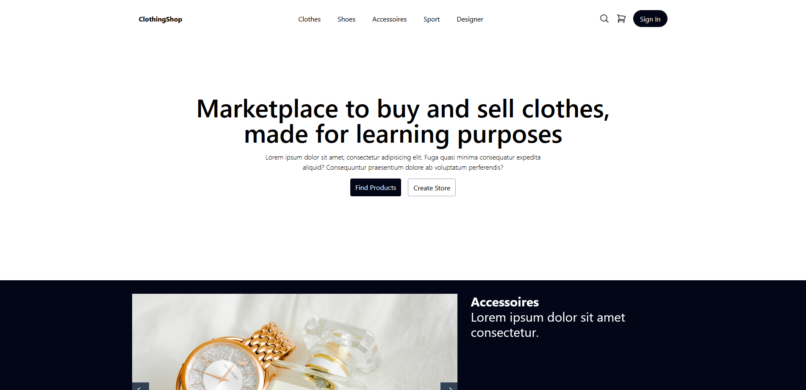

# Clothing Marketplace
A place where you can buy and sell clothes.
<br>




## Getting Started
These instructions will get you a copy of the project up and running on your local machine for development and testing purposes.

Clone the repository to your local machine
```shell
git clone https://github.com/Memo12334/clothing-marketplace.git
```

Install all dependencies
```shell
npm install
```

Start the application
```shell
npm run dev
```

